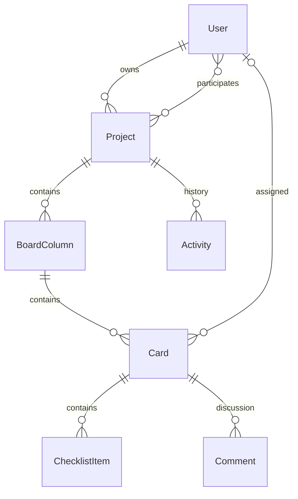

# Поток — управление проектами

Веб-приложение на Django и Python, выросшее из дипломной работы **«Разработка интегрированной системы управления проектами на основе веб-технологий с использованием фреймворка Django и языка программирования Python»**.

Проекты, задачи и команда в одном пространстве. Интерфейс на русском языке, без сборки фронтенда, внешних CDN и обязательного подключения к интернету.

## Запуск в Windows

Из корня репозитория в PowerShell:

```powershell
.\.venv\Scripts\python.exe website/manage.py runserver
```

Откройте **http://127.0.0.1:8000/**. Остановка — `Ctrl+C`.

Если разворачиваете проект с нуля (Python 3.11+):

```powershell
py -3.11 -m venv .venv
.\.venv\Scripts\python.exe -m pip install -r requirements.txt
.\.venv\Scripts\python.exe website/manage.py migrate
.\.venv\Scripts\python.exe website/manage.py createsuperuser
.\.venv\Scripts\python.exe website/manage.py runserver
```

Обычный аккаунт можно создать на странице регистрации. Новый пользователь начинает с пустого пространства.

База данных и загруженные аватары хранятся локально и не входят в репозиторий. После клонирования создайте свою базу через `migrate` и администратора через `createsuperuser`. В исходной локальной базе есть администратор **root**. Если его пароль забыт:

```powershell
.\.venv\Scripts\python.exe website/manage.py changepassword root
```

Панель администратора: **http://127.0.0.1:8000/admin/**.

## Что работает

- Несколько проектов, создание, переименование, описание, цвет и удаление.
- Владелец управляет проектом, колонками и участниками. Участники работают с задачами.
- Добавление зарегистрированного пользователя по точному логину. Отправки писем нет.
- Канбан: создание, редактирование и удаление карточек; перенос между колонками и изменение порядка мышью.
- На телефоне и с клавиатуры колонку можно изменить в окне задачи.
- Исполнитель, кнопка «Взять задачу на себя», приоритет, метка, даты начала и дедлайна.
- Чек-листы и комментарии, сохраняемые отдельно от формы задачи.
- Поиск по названию, описанию и метке; фильтры по исполнителю, приоритету, просрочке.
- «Мои задачи» — фильтр по текущему пользователю внутри открытого проекта.
- Список, календарь дедлайнов и таймлайн по датам задач.
- Обзор: прогресс, просроченные задачи, задачи без исполнителя и загрузка команды.
- История последних 30 событий проекта.
- Экспорт отфильтрованных задач в CSV для Excel.
- Регистрация, вход, профиль с аватаром, смена пароля и выход через POST.
- Сохранён раздел новостей; запись и изменение доступны по правам Django.
- Сочетания клавиш: `N` — новая задача, `/` — поиск, `Esc` — закрыть окно. Вкладки доступны стрелками.
- Доска обновляется каждые 30 секунд, когда окно задачи закрыто; есть ручное обновление.
- При одновременном редактировании сервер отклоняет устаревшую версию карточки. Черновик остаётся в форме.

Чтобы задача считалась завершённой, перенесите её в колонку с настройкой **«Задачи в этой колонке завершены»**. Удалить можно только пустую колонку; последнюю колонку удалить нельзя.

## Пример проекта

Для локального `root` уже создан отдельный проект **«Запуск продукта»**. Он содержит 11 примерных задач, четыре этапа, сроки, метки, чек-листы и комментарий. Данные примера можно свободно менять.

Для другого существующего аккаунта:

```powershell
.\.venv\Scripts\python.exe website/manage.py demo_project --username ваш_логин
```

Повторный запуск не создаёт дубликат проекта и не изменяет пароли.

## Сохранность старых данных

Перед обновлением создана согласованная SQLite-копия:
`backups/before_upgrade_20260926_171753.sqlite3`.

Миграция `management.0004` переносит прежние колонки и JSON-подзадачи в личные проекты:
**39 колонок → 6 проектов → 72 карточки** в исходной локальной базе. Старые записи `management.Task` сохранены без удаления. Исходные статусы и исполнители из старого JSON при необходимости записаны в описание, чтобы перенос не открывал личные проекты другим пользователям. Старые пользователи, аватары и новости сохранены.

Миграция данных намеренно необратима: новые задачи могут быть отредактированы после переноса. Для полного возврата к предыдущей версии используйте резервную копию вместе с прежней версией кода, предварительно остановив сервер.

Создать новую копию базы:

```powershell
.\.venv\Scripts\python.exe website/manage.py backup_database
```

Пользовательские изображения лежат в `website/media/`; их нужно копировать отдельно. База данных, загрузки, резервные копии, файлы Word, настройки IDE и кэш Python исключены из Git. В ранних коммитах эти файлы могли присутствовать; текущая версия репозитория содержит исходный код, статику приложения и документацию.

## Устройство

```text
website/
  website/                  настройки и общая маршрутизация
  management/
    models.py               проекты, колонки, карточки, чек-листы, комментарии
    views.py                HTML-страница и JSON API с проверкой доступа
    forms.py                серверная валидация
    migrations/             схема и перенос исходных задач
    management/commands/    пример проекта и резервное копирование
    tests.py                проверки доступа и логики
    browser_checks.py       сценарии в реальном Chrome
  main/
    templates/main/         общий шаблон, локальные SVG-иконки
    static/main/css/        единый адаптивный интерфейс
    static/main/js/          состояние доски, окна, фильтры, drag-and-drop
  users/                    аккаунты и профиль
  news/                     новости
```



Основные адреса:

| Адрес | Назначение |
| --- | --- |
| `/management/` | Последний созданный доступный проект или начало работы |
| `/management/project/<id>/` | Конкретный проект |
| `/management/api/projects/` | GET: доступные проекты; POST: создание |
| `/management/api/projects/<id>/` | GET: состояние доски; POST: действие |
| `/user/profile/` | Профиль |
| `/user/password/` | Смена пароля |
| `/news/` | Новости |

POST API использует JSON с полем `action` и стандартный CSRF-токен Django. Доступ к каждому проекту и вложенному объекту проверяется на сервере. Карточка хранит `version`, необходимую для изменения, перемещения, назначения на себя и удаления. Изменения выполняются в транзакциях. HTML пользователя не исполняется.

## Проверки

```powershell
.\.venv\Scripts\python.exe website/manage.py check
.\.venv\Scripts\python.exe website/manage.py makemigrations --check --dry-run
.\.venv\Scripts\python.exe website/manage.py test management users news
```

Проверки интерфейса используют отдельную тестовую базу, создают тестовых пользователей и не меняют рабочие аккаунты:

```powershell
.\.venv\Scripts\python.exe -m pip install -r requirements-dev.txt
.\.venv\Scripts\python.exe website/manage.py test management.browser_checks
```

Нужен установленный Google Chrome. Playwright использует `channel='chrome'`, отдельный браузер загружать не требуется. Скриншоты и пример CSV сохраняются в `artifacts/`.

## Настройки и границы версии

SQLite подходит для локальной работы и демонстрации. Доска использует HTTP-запросы и периодическое обновление; WebSocket-синхронизации нет. Таймлайн показывает реальные даты задач, но не рассчитывает зависимости и критический путь. Файловые вложения, почтовые уведомления, личный чат и финансовый учёт в эту версию не входят.

Зависимости зафиксированы в `requirements.txt`. Используется ветка [Django 5.2 LTS](https://www.djangoproject.com/download/).

Переменные окружения описаны в `.env.example`. Файл `.env` автоматически не загружается:

```powershell
$env:DJANGO_DEBUG = "0"
$env:DJANGO_ALLOWED_HOSTS = "your-domain.example"
$env:DJANGO_SECRET_KEY = "ваш-уникальный-случайный-секрет"
```

При `DEBUG=0` требуется собственный секрет и включаются защищённые cookies. Для публикации нужны HTTPS, WSGI/ASGI-сервер, выдача статики после `collectstatic`, резервное копирование и подходящая серверная база. Локальный `runserver` предназначен для разработки.
